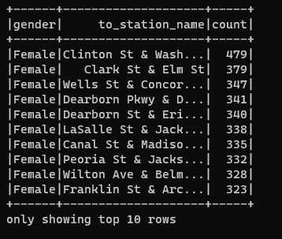

# Week-04 Lab

## Assignment Setup

- Using the file Divvy_Trips_2015-Q1.zip, extract the CSV file provided
- In your local repo add the following data types to the `.gitignore` file
  - *.csv
  - *.txt
  - *.json
  - `target/` to ignore jarfile artifacts
- You can extract a compressed Zip file using the command: `unzip Divvy_Trips_2015-Q1.zip`
  - May have to use `sudo apt-get install unzip` if application not found
- Complete the assignment and push this Readme.md template to the remote repo.

## Assignment Details

- In your local Git Repo, create a folder named **labs** under the `itmd-521` folder and create a sub-folder ~~**assignment-01**~~  **week-04** and place this Readme.md template in that directory along with the required pieces of code
  - You will create two programs, one in Python and one in Scala
    - Python: assignment-01.py
    - Scala: assignment-01.scala
  - Per language file, create three data frames reading the extracted `Divvy_Trips_2015-Q1.csv` from your local system
    - First **infer the schema** and read the csv file
    - Second programmatically use **StructFields** to create and attach a schema and read the csv file
    - Third attach a schema via a DDL and read the csv file
- After each read operation include the function `printSchema()`
  - [printSchema()](https://spark.apache.org/docs/latest/api/python/reference/api/pyspark.sql.DataFrame.printSchema.html "pyspark printschema web page")
  - [printSchema](https://spark.apache.org/docs/latest/api/scala/org/apache/spark/sql/Dataset.html#printSchema():Unit "scala pyspark API")
- Also use the `.count()` function to display the number of records in each DataFrame
  - [.count()](https://spark.apache.org/docs/latest/api/scala/org/apache/spark/sql/Dataset.html "webapge to Scala API")
  - [count() - Pyspark](https://spark.apache.org/docs/latest/api/python/reference/api/pyspark.sql.DataFrame.count.html "Pyspark webapge for API")  

## Assignment Details Continued

- You will run some Transformations and Actions
  - Use a `select` function to select Gender
  - If your last name starts with A-K select female, L-Z select male
  - GroupBy the field `station to`
  - Issue a show function displaying 10 records of the DataFrame (up to page 62 in the text book)
- Repeat the above steps and create a file named: `assignment-01.scala`
  - Compile and test the code using the sbt compiler

  ## Transformations and Actions output for python
  

  ## Transformations and Actions output for Scala
  

### Screen Shots

Add the required screenshots here:

### Screenshot of the printSchema inferred in Python

### Screenshot of the printSchema programmatically in Python

### Screenshot of the printSchema via DDL in Python

### Screenshot of the printSchema inferred in Scala

### Screenshot of the printSchema programmatically in Scala

### Screenshot of the printSchema via DDL in Scala

### Deliverable

Submit to Blackboard the URL to the folder in your GitHub repo. I will clone your code, compile it, and run it to test the functionality. Include your `build.sbt` and all needed scaffolding files as well, but not your build artifacts.

Due at the **Start of class** February 7th 1:50pm
